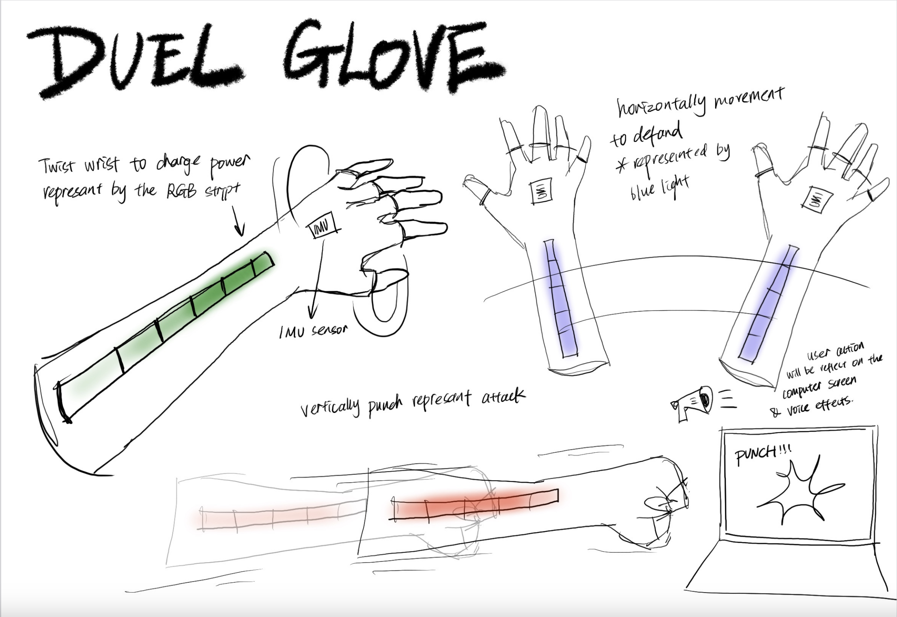

# Assignment #3: Capybara Onsen Game

## Introduction

This project is a playful interactive prototype where you control a capybara enjoying an onsen (hot spring). The capybara is equipped with motion sensors (via a wearable glove) that detect three distinct gestures:

- **Defend Pose:** Triggered by a quick horizontal swipe to “catch” falling oranges.
- **Attack Pose:** Triggered by a strong upward punch to “pouch” away falling leaves or poop.
- **Charging Pose:** Triggered by a slow, sustained twist to “suck in” all falling objects at once.

The goal is to collect 10 oranges to win the game. Each falling unwanted object (leaves/poop) reduces the orange count by 2.

Below is a sample concept sketch of the project:
  

*Figure 1: Initial concept sketch of the Capybara Onsen Game.*

## State Diagram

The interactive behaviors are represented in the following state diagram. The diagram shows how the system transitions between the four states based on the motion input from the IMU sensor.
