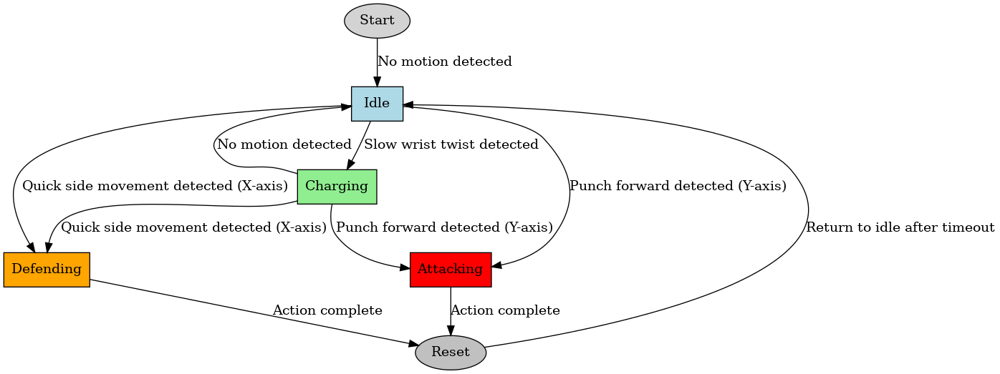
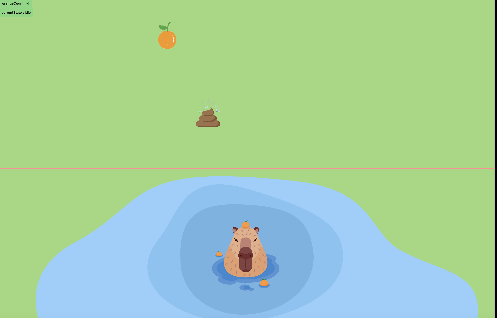

# Assignment #3: Capybara Onsen Game

## Introduction

This project is a playful interactive prototype where you control a capybara enjoying an onsen (hot spring). The capybara is equipped with motion sensors (via a wearable glove) that detect three distinct gestures:

- **Defend Pose:** Triggered by a quick horizontal swipe to “catch” falling oranges.
- **Attack Pose:** Triggered by a strong upward punch to “pouch” away falling leaves or poop.
- **Charging Pose:** Triggered by a slow, sustained twist to “suck in” all falling objects at once.

The goal is to collect 3 oranges to win the game. Each falling unwanted object (leaves/poop) reduces the orange count by 2.

Below is a sample concept sketch of the project:
  

*Figure 1: Initial concept sketch of the Capybara Onsen Game.*

## State Diagram

The interactive behaviors are represented in the following state diagram. The diagram shows how the system transitions between the four states based on the motion input from the IMU sensor.



## Hardware

The hardware components used in this project include:

- **ESP32 Microcontroller** 
- **NeoPixel RGB LED Strip (30 pixels)**
- **IMU Sensor**

## Firmware

The firmware is written in MicroPython. Below is the main code that controls the interactive behaviors of the prototype.
```python

import os, sys, io
import M5
from M5 import *
from hardware import I2C, Pin
from unit import IMUProUnit
from time import sleep_ms, ticks_ms, ticks_diff
from neopixel import NeoPixel

M5.begin()


i2c = I2C(0, scl=Pin(1), sda=Pin(2), freq=100000)
imu = IMUProUnit(i2c)

NUM_PIXELS = 30
np = NeoPixel(Pin(7), NUM_PIXELS)

# Initialize previous sensor values for change detection
imu_x_last = 0.0
imu_y_last = 0.0

# Define game/motion states
STATE_IDLE      = 0
STATE_CHARGING  = 1
STATE_ATTACKING = 2
STATE_DEFENDING = 3

# For printing descriptive state names to the serial monitor:
state_names = {
    STATE_IDLE:      "idle",
    STATE_CHARGING:  "charge",
    STATE_ATTACKING: "attack",
    STATE_DEFENDING: "defend"
}

current_state = STATE_IDLE

# Variables for charging logic
charge_level = 0      
twist_start_time = 0  
last_twist_time = 0   # Last time a twist was detected
charging_in_progress = False

# Variables for attack and defense timing
attack_start_time = 0
defend_start_time = 0
ATTACK_DURATION = 1000  
DEFEND_DURATION = 1000 

# Thresholds for detecting motions
CHARGE_THRESHOLD = 0.2   # Minimal change in x-axis for a slow twist
SWIPE_THRESHOLD  = 1.0   # Fast x-axis movement triggers defense
CHARGE_DEBOUNCE  = 200   # Twist must be sustained for at least 200ms to count
CHARGE_TIMEOUT   = 600   # 600ms without twist ends charging
PUNCH_THRESHOLD  = 0.7   # Rapid increase in y-axis for attack

def clear_pixels():
    for i in range(NUM_PIXELS):
        np[i] = (0, 0, 0)
    np.write()

# LED animation functions
def show_charging():
    clear_pixels()
    for i in range(charge_level):
        np[i] = (0, 255, 0) 
    np.write()

def show_attacking():
    for i in range(NUM_PIXELS):
        np[i] = (255, 0, 0) 
    np.write()

def show_defending():
    for i in range(NUM_PIXELS):
        np[i] = (0, 0, 255) 
    np.write()

while True:
    M5.update()
    now = ticks_ms()
    
    imu_val = imu.get_accelerometer()
    imu_x = imu_val[0]
    imu_y = imu_val[1]
    
    #print("X:||" + str(imu_x))
    #print("Y:||"+str(imu_y))
    print("State:||"+ str(state_names[current_state]))
    
    
    # State Transition Logic 
    
    # 1. Defense Detection: Quick horizontal movement on x-axis
    if abs(imu_x - imu_x_last) > SWIPE_THRESHOLD:
        current_state = STATE_DEFENDING
        defend_start_time = now
        charging_in_progress = False
        charge_level = 0

    # 2. Charging Detection: Slow twist 
    elif abs(imu_x - imu_x_last) > CHARGE_THRESHOLD and abs(imu_x - imu_x_last) < SWIPE_THRESHOLD:
        last_twist_time = now
        if not charging_in_progress:
            charging_in_progress = True
            twist_start_time = now
        if ticks_diff(now, twist_start_time) > CHARGE_DEBOUNCE:
            current_state = STATE_CHARGING
            charge_level += 1
            if charge_level > NUM_PIXELS:
                charge_level = NUM_PIXELS

    else:
        # End charging if no twist detected within timeout
        if charging_in_progress:
            if ticks_diff(now, last_twist_time) > CHARGE_TIMEOUT:
                charging_in_progress = False
                current_state = STATE_IDLE

    # 3. Attack Detection: Strong upward punch 
    if (imu_y - imu_y_last) > PUNCH_THRESHOLD:
        current_state = STATE_ATTACKING
        attack_start_time = now

    #  LED Output 
    if current_state == STATE_CHARGING:
        show_charging()
    elif current_state == STATE_ATTACKING:
        show_attacking()
        if ticks_diff(now, attack_start_time) > ATTACK_DURATION:
            current_state = STATE_IDLE
            charge_level = 0 
    elif current_state == STATE_DEFENDING:
        show_defending()
        if ticks_diff(now, defend_start_time) > DEFEND_DURATION:
            current_state = STATE_IDLE
    else:
        clear_pixels()
    
    # Update previous sensor values for next iteration
    imu_x_last = imu_x
    imu_y_last = imu_y

    sleep_ms(100)
```


## Key Firmware Features

- **Input:** the imu sensor catch user's hand motion acceleration on X and Y axis.
- **Output:** the led light stript on the glove output different light expression according to different state.

## Physical Components

- NeoPixel RGB LED Strip
- hand gloves

## Project Outcome

The Capybara Adventure Game successfully implements core mechanics, including movement, collision detection, and score tracking. The game provides a fun and interactive experience, with smooth animations and clear UI feedback.


Figure 4: Screenshot of the completed game prototype.

## Video Demonstration

<iframe src="https://drive.google.com/file/d/1XJo9NxYdJLLQtZBURAWH4ZnCYIdrHxlE/preview" width="640" height="480" allow="autoplay"></iframe>
Figure 5: Video walkthrough of the Capybara Adventure Game.

