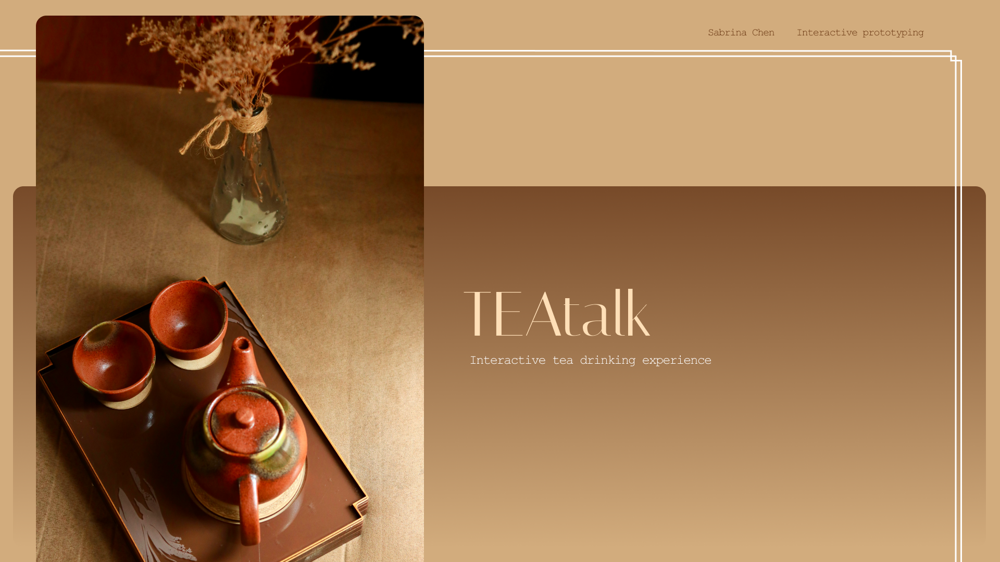
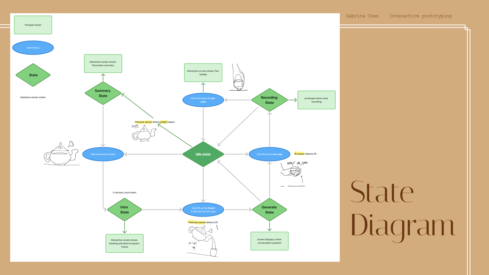
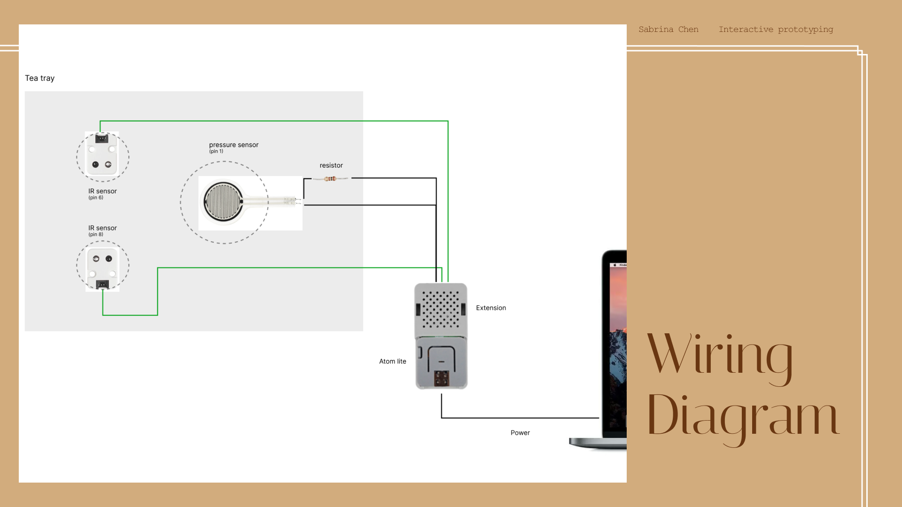
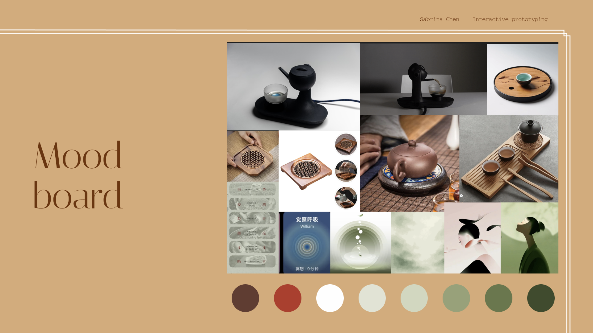
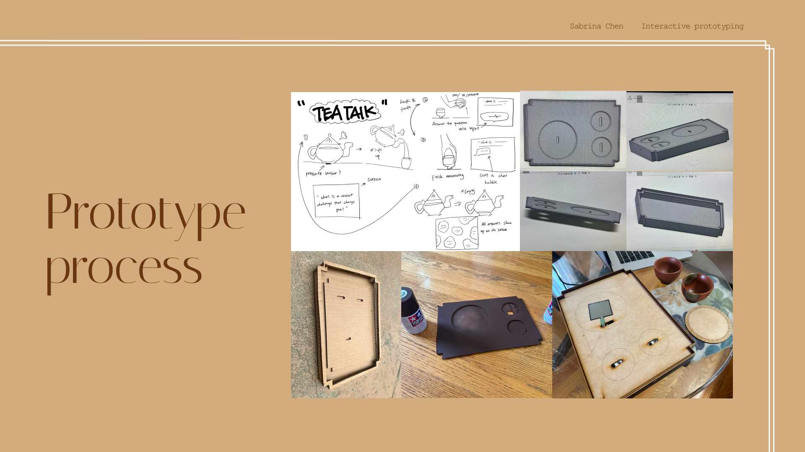
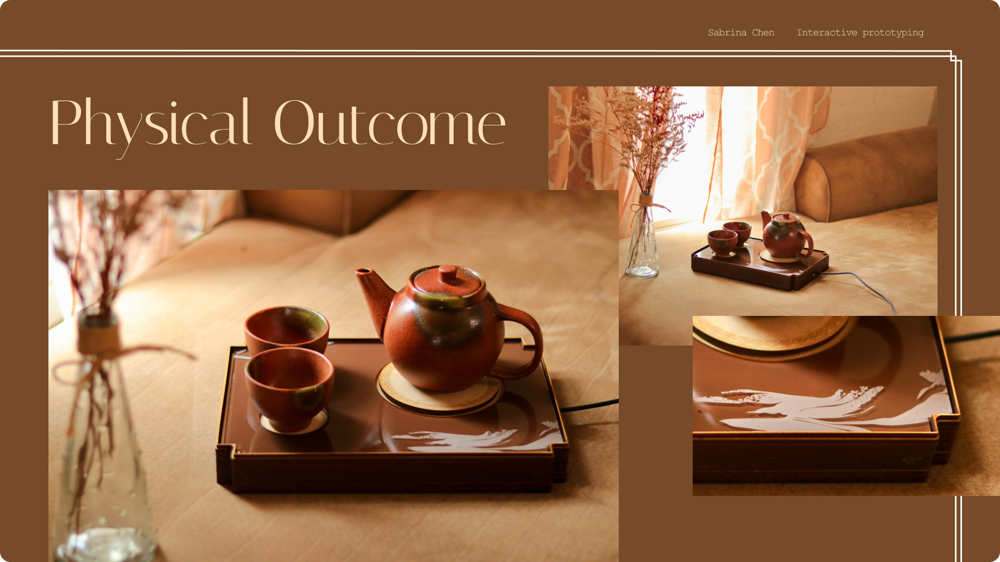

# TeaTalk: Interactive Tea-Drinking Discussion Experience

## Introduction
TeaTalk transforms the traditional tea-drinking ritual into an interactive social experience. During the 3-minute brew time, a digital screen guides participants through a series of prompts. Lifting the teapot, pouring tea, and lifting/placing teacups trigger questions, voice recording, and a dynamic “speech bubble” display of responses.

**Context & Audience**  
- **Context:** Living room, office lounge, or gallery installation  
- **Use Case:** Ice-breaker sessions, team-building exercises, social gatherings  
- **Audience:** Friends, coworkers, exhibition visitors

---

## Implementation

TeaTalk consists of hardware sensors integrated with firmware (MicroPython) running on an ESP32 (ATOM board), and software visuals created in ProtoPie. User interactions are detected via pressure and light sensors, translating physical actions into on-screen conversation prompts and animations.

### State Diagram
  
   
  
### Hardware
  
* Pressure Sensor (Pin 1) – detects teapot weight & fill level
* IR Sensor 1 (Pin 8) – detects User 1 cup lift
* IR Sensor 2 (Pin 6) – detects User 2 cup lift
* Atom Lite – runs MicroPython firmware
* Resistor
* Connect wires
* usb cable

### Schematic or Wiring Diagram



### Firmware   


``` Python  
from machine import Pin, ADC
from time import sleep_ms, ticks_ms, ticks_diff

# -----------------------------
# Sensor Setup
# -----------------------------
# Pressure Sensor (Teapot) on Pin 1
pressure_pin = Pin(1, Pin.IN)
pressure_adc = ADC(pressure_pin)
pressure_adc.atten(ADC.ATTN_11DB)

# Light Sensors (Teacups) on Pins 8 and 6
light_pin_1 = Pin(8, Pin.IN)
light_adc_1 = ADC(light_pin_1)
light_adc_1.atten(ADC.ATTN_11DB)

light_pin_2 = Pin(6, Pin.IN)
light_adc_2 = ADC(light_pin_2)
light_adc_2.atten(ADC.ATTN_11DB)

# -----------------------------
# Thresholds
# -----------------------------
TEA_READY_THRESHOLD = 50    # <45: tea in pot
TEAPOT_LIFTED_VAL  = 255    # =255: pot lifted
LIGHT_LIFT_THRESHOLD = 70   # >70: cup lifted

HALF_FILL_LOW     = 43      # 43–50: half fill
HALF_FILL_HIGH    = 50
FULL_FILL_LOW     = 35      # 35–40: full fill
FULL_FILL_HIGH    = 40

DEBOUNCE_TIME_MS  = 800

# -----------------------------
# States
# -----------------------------
STATE_IDLE       = "idle"
STATE_INTRO      = "intro"
STATE_GENERATE   = "generate_question"
STATE_RECORDING1 = "recording1"
STATE_RECORDING2 = "recording2"

current_state    = STATE_IDLE

# -----------------------------
# Flags & Timers
# -----------------------------
in_intro         = False
intro_start_time = 0
last_pressure    = 255
last_lift_time   = 0

recording1       = False
recording2       = False

half_announced   = False
intro_done       = False
empty_announced  = False

# -----------------------------
# Helper Functions
# -----------------------------
def read_pressure():
    return int(pressure_adc.read() / 16)

def read_light(adc):
    return int(adc.read() / 16)

def send(msg):
    print(msg)

# -----------------------------
# Main Loop
# -----------------------------
while True:
    now = ticks_ms()
    p   = read_pressure()
    l1  = read_light(light_adc_1)
    l2  = read_light(light_adc_2)

    # Reset empty flag when pot refilled
    if p < TEA_READY_THRESHOLD:
        empty_announced = False

    print("State:||"+current_state)
    print("pressure:", p)

    # --- TEAPOT LIFTED → generate question
    if p == TEAPOT_LIFTED_VAL and ticks_diff(now, last_lift_time) > DEBOUNCE_TIME_MS:
        last_lift_time = now
        if current_state != STATE_GENERATE:
            send("TEAPOT_LIFTED")
            current_state = STATE_GENERATE

    # --- TEAPOT PUT DOWN → back to idle
    if p < TEA_READY_THRESHOLD and current_state == STATE_GENERATE:
        send("IDLE")
        current_state = STATE_IDLE

    # --- USER1 Recording
    if l1 > LIGHT_LIFT_THRESHOLD and not recording1 and current_state != STATE_INTRO:
        send("USER1_START_RECORDING")
        current_state = STATE_RECORDING1
        recording1    = True

    if recording1 and l1 <= LIGHT_LIFT_THRESHOLD:
        send("USER1_STOP_RECORDING")
        current_state = STATE_IDLE
        recording1    = False

    # --- USER2 Recording
    if l2 > LIGHT_LIFT_THRESHOLD and not recording2 and current_state != STATE_INTRO:
        send("USER2_START_RECORDING")
        current_state = STATE_RECORDING2
        recording2    = True

    if recording2 and l2 <= LIGHT_LIFT_THRESHOLD:
        send("USER2_STOP_RECORDING")
        current_state = STATE_IDLE
        recording2    = False

    # --- TEAPOT EMPTY → send once
    if (TEA_READY_THRESHOLD <= p < TEAPOT_LIFTED_VAL): # and not empty_announced:
        send("TEAPOT_EMPTY")
        empty_announced = True

    # --- HALF FILL detection (only once)
    if HALF_FILL_LOW <= p <= HALF_FILL_HIGH: #and not half_announced:
        send("TEAPOT_HALF_FILL")
        half_announced = True

    # --- FULL FILL detection & INTRO (only once)
    if FULL_FILL_LOW <= p <= FULL_FILL_HIGH and not intro_done:
        send("TEAPOT_FULL_FILL")
        send("INTRO")
        current_state     = STATE_INTRO
        in_intro          = True
        intro_start_time  = now
        intro_done        = True

    # --- INTRO ends after 10s → back to idle
    if in_intro and ticks_diff(now, intro_start_time) >= 10000:
        send("IDLE")
        current_state = STATE_IDLE
        in_intro      = False

    last_pressure = p
    sleep_ms(200)

```

### Integrations   

I integrate protopie connect into the project to show and send state messages when user performs actions, in order to made some changes to the digital display. 
I also activate API connection using protopie connect to integrate chatgpt and give me different icebreaking questions everytime user serve a cup of tea.

### Enclosure / Mechanical Design   

I created a 3d model for a physical prototype, and laser-cut it out with cardboard to test the size and made some adjustments, then laser-cut the final product using MDF wood boards and acrylic board. I spray paint on it to finish the look.



## Project outcome  

TeaTalk delivers a seamless, elegant discussion ritual:

* Prompt Display during brew
* Real-time Recording when users lift cups
* Fill-level Alerts: half-fill & full-fill icons

Physical outcome:

  
Video Walkthrough:

<iframe src="https://drive.google.com/drive/u/0/folders/12ZdyTWdkB58vi4rymk1PgR4ZAxEeODOW" width="640" 

## Conclusion  

Creating TeaTalk was both rewarding and insightful, blending cultural rituals with modern technology. Challenges included sensor calibration and ensuring stable serial communication. Also try to detect details and make sure there is no typing mistake to screw up protopie. Given more time, future enhancements could provide more robust user identification to enhance personalization.
