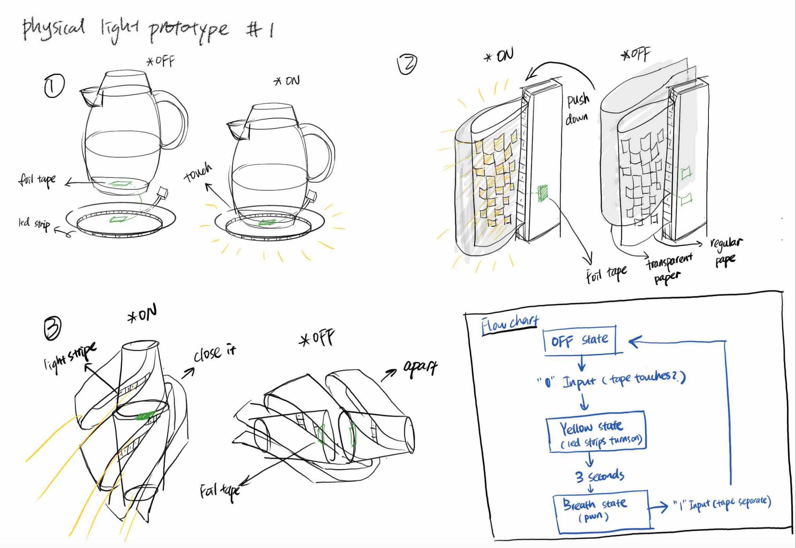

# Assignment #3: Interactive Light Prototype

## Introduction

This project is an interactive light prototype that uses an RGB LED strip and a PWM-controlled LED to create dynamic lighting effects based on user interaction. The idea is to have the light change states depending on the contact of copper tape acting as a button.

- **Concept:**  
  - **OFF State:** The light is off.  
  - **YELLOW State:** When the copper tape contacts (input activated), the LED strip turns yellow for 3 seconds.  
  - **BREATH State:** After 3 seconds, a breathing (pulsing) effect is activated via a PWM-controlled LED until the copper tape is released.

- **Concept Sketches:**  
  
  

